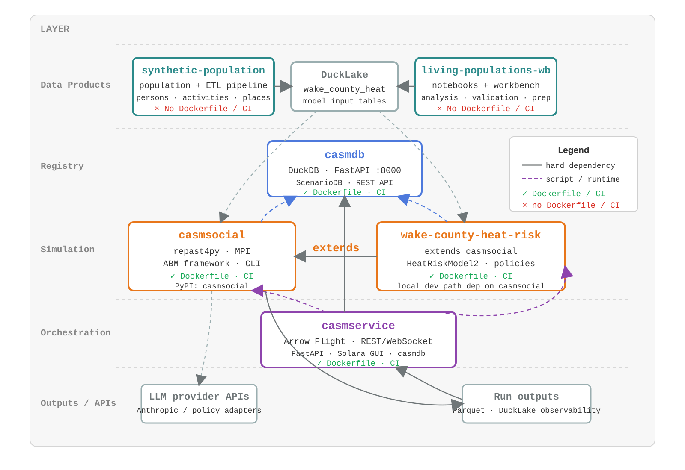

# Codebase Relationships

The CASM social-simulation workspace is split across six repositories. The
boundaries are intended to keep reusable simulation infrastructure separate from
model-specific logic, catalog/service orchestration, and population data
production.

## Repository Roles

| Repository | Role | Main interfaces |
| --- | --- | --- |
| `casmsocial` | Reusable agent-based simulation framework built on repast4py and MPI. | Python package, `python -m casmsocial`, YAML parameters, DuckLake input tables, Parquet/DuckLake outputs. |
| `wake-county-heat-risk` | Wake County model package that adds heat exposure, cooling-center, broadcast-message, and experiment logic on top of `casmsocial`. | Python plugin package, Wake YAML configs, `register_heat_risk.py`, Wake DuckLake tables. |
| `casmdb` | Catalog for model metadata, model versions, named scenarios, JSON schemas, and deterministic output-directory contracts. | Python `ScenarioDB`, FastAPI `/models` and `/scenarios` endpoints. |
| `casmservice` | Service and GUI layer that resolves catalog entries and launches simulation backends. | ZeroC Ice service, Solara GUI, `casmdb` HTTP API, `mpiexec python -m casmsocial`. |
| `synthetic-population` | Data pipeline that produces model-ready synthetic population, activity, place, weather, and experiment data products. | Processed Parquet outputs and DuckLake schemas such as `wake_county_heat`. |
| `living-populations-wb` | Workbench for exploratory analysis, validation, and geospatial data preparation around living-population products. | Notebooks, local analysis scripts, DuckLake/Parquet data products. |

## Primary Flows

1. Data preparation starts in `synthetic-population` and
   `living-populations-wb`, then publishes DuckLake tables consumed by
   simulations.
2. `casmsocial` supplies the core runtime, model registry, table-loading
   conventions, MPI partitioning support, behavior engines, communication, and
   output observers.
3. `wake-county-heat-risk` depends on `casmsocial` and supplies Wake-specific
   model classes, policies, and configurations.
4. `casmdb` stores model records and scenario parameter sets for both
   `casmsocial` baseline scenarios and Wake heat-risk scenarios.
5. `casmservice` uses `casmdb` to resolve what to run, launches the
   `casmsocial` backend, and reads outputs for live or post-run inspection.
